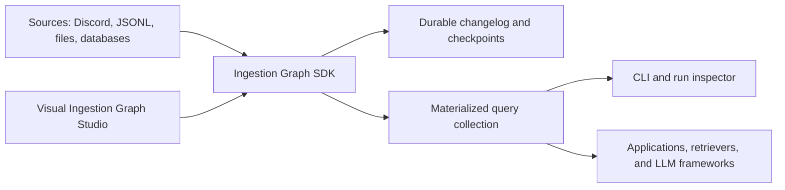

# Ingest and query architecture

Ingestion Graph is deliberately not another LLM chain framework. LangChain-style
libraries compose model calls, prompts, retrievers, and agents. This SDK owns the
data plane that comes before those layers: source synchronization, stable record
identity, checkpoints, replay, upserts, deletes, artifacts, provenance, and
materialized query views.

That boundary makes the two complementary:

| Concern | Ingestion Graph SDK | LLM chain framework |
| --- | --- | --- |
| Incremental source sync | First-class checkpoints and cursors | Loader-specific |
| Replay and idempotency | Required destination contract | Usually application code |
| Changes and deletes | Canonical UPSERT/DELETE envelopes | Often flattened documents |
| Provenance | Preserved on every envelope and query hit | Varies by retriever |
| Local inspection | SQLite current view and full-text query | Usually requires a vector store |
| Models and prompts | Optional adapters | Core responsibility |

The query layer remains model-independent. It returns canonical envelopes, scores,
metadata, and provenance. A project may pass those hits into LangChain, an OpenAI
response workflow, a custom agent, or no model at all.

## Product boundary



The installable `ingestion_graph` package is the reusable data plane. The FastAPI
and Svelte application is the optional visual control plane and imports the SDK.
The SDK never imports the application.

## Testing a pipeline locally

In the CLI, ingest any newline-delimited JSON file into a zero-infrastructure
SQLite collection, then inspect or search the current view:

```shell
ingestion-graph ingest-jsonl events.jsonl --collection .ingestion/events.db
ingestion-graph query --collection .ingestion/events.db
ingestion-graph query "deployment failed" --collection .ingestion/events.db
```

In Studio, connect the final transformation node to **Queryable Test Store**. After
the run completes, open the run detail and use **Query Pipeline Output**. Each run
gets an isolated SQLite collection addressed by its run ID, and the API verifies
graph ownership before returning records.

The **Document Deltas to Search** starter is intentionally incremental. Its SDK
Document Source resumes owner-scoped uploads from PostgreSQL state and preserves
canonical record IDs and delete operations in emitted items. The run-scoped query
store shows only that run's delta; it is not a durable current view of records from
earlier runs. A persistent destination that applies upserts and tombstones is the
next Studio synchronization boundary.

## Direction for query graphs

The current query collection is the first vertical slice: ingest, materialize, and
inspect. A full query graph should continue using the same canvas but have explicit
query types and execution semantics:

1. Query Input
2. Filter or Query Embedder
3. SQLite, SQL, or Vector Retriever implementing the SDK query contract
4. Optional reranker
5. Results or model response

Query hits must retain their original envelope identity and provenance. Retriever
plugins can then integrate pgvector, OpenSearch, or external vector databases
without coupling ingestion correctness to any one LLM framework.
